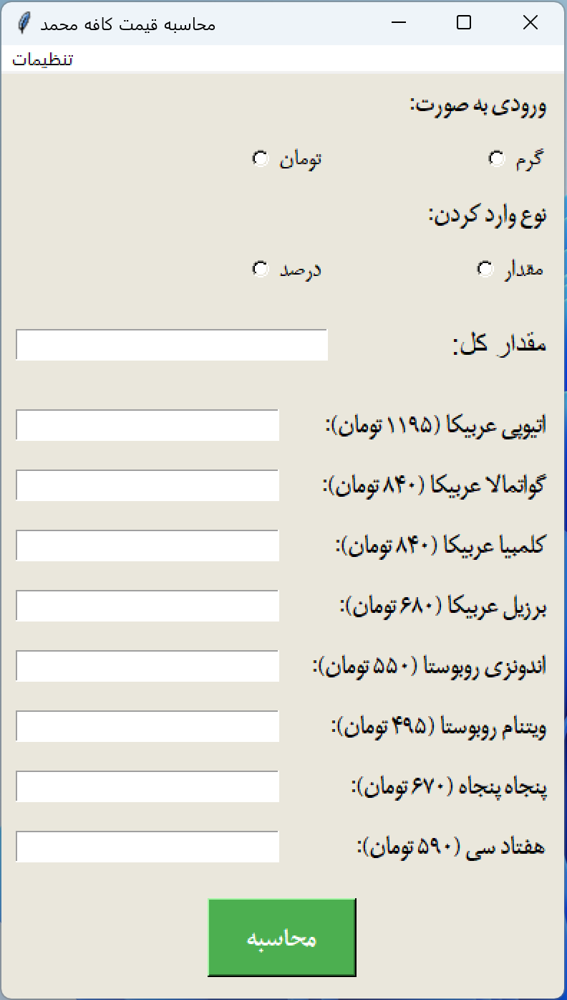
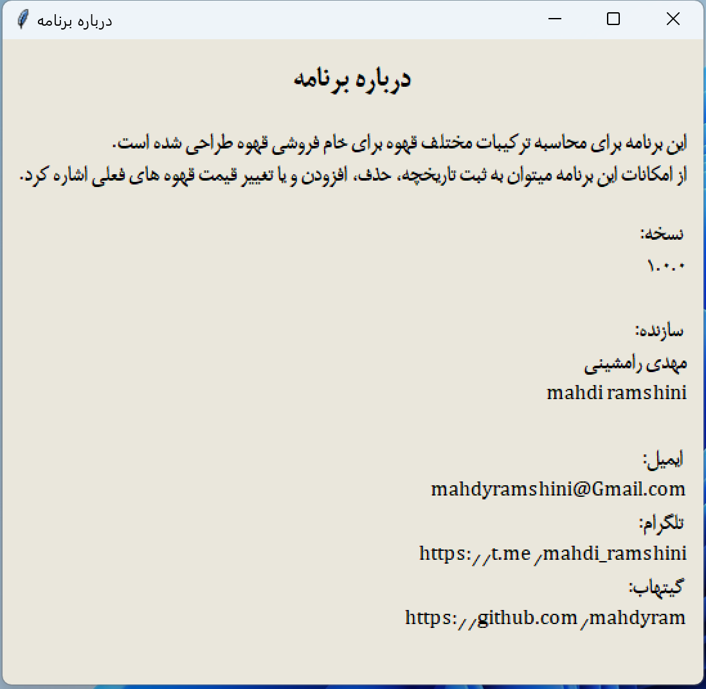

# CafeBlendManager-Project
Coffee Blend Manager Project: A comprehensive tool designed to help manage and calculate custom coffee blends for cafés. This project includes features like price calculations, blend history tracking, and easy customization of coffee options.
## images

    
    

## images

